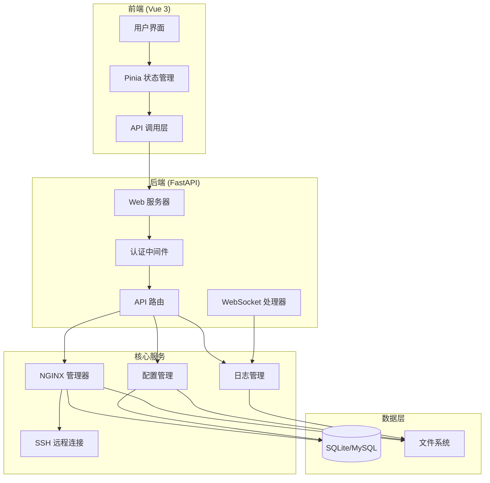
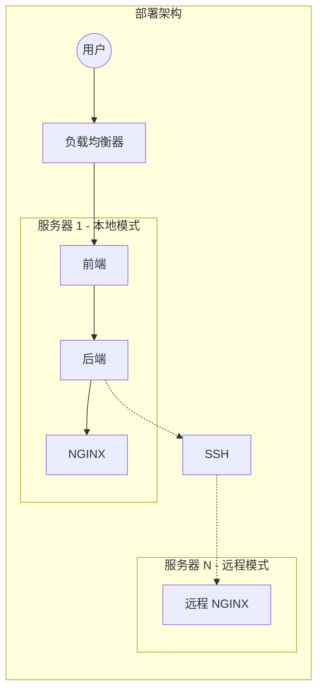
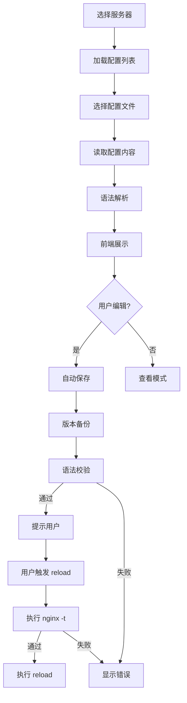
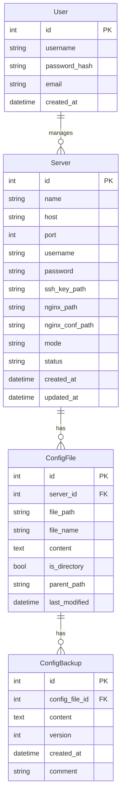

# NGINX UI 系统技术规格说明书

## 1. 项目概述

### 1.1 项目背景
NGINX UI 是一个基于 Web 的 NGINX 可视化管理平台，旨在提供简洁高效的 NGINX 配置管理和监控能力。

### 1.2 核心功能
- 本地/远程 NGINX 服务器管理
- 在线配置预览与编辑（格式化、语法提示、自动保存、备份）
- 配置检测与热加载（reload/restart）
- 日志实时查看（WebSocket tail 方式）

---

## 2. 技术选型

### 2.1 后端技术栈

| 技术 | 版本 | 说明 |
|------|------|------|
| Python | 3.10+ | 编程语言 |
| FastAPI | 0.104+ | Web 框架 |
| SQLAlchemy | 2.0+ | ORM |
| Pydantic | 2.0+ | 数据验证 |
| Paramiko | 2.12+ | SSH 远程连接 |
| WebSocket | - | 实时日志 |

### 2.2 前端技术栈

| 技术 | 版本 | 说明 |
|------|------|------|
| Vue | 3.4+ | 框架 |
| TypeScript | 5.0+ | 语言 |
| Element Plus | 2.5+ | UI 组件库 |
| Pinia | 2.1+ | 状态管理 |
| VueUse | 10.0+ | 工具 Hooks |
| Monaco Editor | 0.45+ | 代码编辑器 |
| Socket.io-client | 4.6+ | WebSocket 客户端 |

---

## 3. 系统架构

### 3.1 整体架构图



### 3.2 部署架构



---

## 4. 功能模块设计

### 4.1 服务器管理模块

#### 功能
- 添加/编辑/删除 NGINX 服务器
- 支持本地和远程两种模式
- 服务器状态监控

#### 数据模型

```python
class Server(Base):
    id: int
    name: str
    host: str  # IP 或主机名
    port: int = 22  # SSH 端口
    username: str
    password: Optional[str]  # 或使用 SSH key
    ssh_key_path: Optional[str]
    nginx_path: str  # nginx 二进制路径
    nginx_conf_path: str  # nginx.conf 路径
    mode: str  # "local" | "remote"
    status: str  # "online" | "offline"
    created_at: datetime
    updated_at: datetime
```

### 4.2 配置管理模块

#### 功能
- 读取和解析 nginx.conf
- 配置文件树形展示
- 在线编辑（Monaco Editor）
- 格式化输出
- 语法高亮
- 自动保存（debounce）
- 版本备份

#### 核心流程



#### 数据模型

```python
class ConfigFile(Base):
    id: int
    server_id: int
    file_path: str
    file_name: str
    content: Optional[str]
    is_directory: bool
    parent_path: str
    last_modified: datetime

class ConfigBackup(Base):
    id: int
    config_file_id: int
    content: str
    version: int
    created_at: datetime
    comment: Optional[str]
```

### 4.3 日志管理模块

#### 功能
- 列出日志目录
- 日志文件选择
- 实时日志 tail
- 日志搜索
- 日志下载

#### WebSocket 协议

```typescript
// 客户端 -> 服务器
interface LogRequest {
    action: "start" | "stop" | "search";
    server_id: number;
    log_path: string;
    lines?: number;  // 初始加载行数
    keyword?: string;  // 搜索关键词
}

// 服务器 -> 客户端
interface LogResponse {
    action: "log" | "error" | "status";
    data: string;
    timestamp: number;
}
```

### 4.4 服务控制模块

#### 功能
- 获取 NGINX 状态
- 测试配置文件（nginx -t）
- 重载配置（nginx -s reload）
- 重启服务（systemctl restart nginx）
- 启动/停止服务

---

## 5. API 接口设计

### 5.1 认证相关

| 方法 | 路径 | 说明 |
|------|------|------|
| POST | /api/auth/login | 用户登录 |
| POST | /api/auth/logout | 用户登出 |
| GET | /api/auth/me | 获取当前用户 |

### 5.2 服务器管理

| 方法 | 路径 | 说明 |
|------|------|------|
| GET | /api/servers | 获取服务器列表 |
| POST | /api/servers | 添加服务器 |
| GET | /api/servers/{id} | 获取服务器详情 |
| PUT | /api/servers/{id} | 更新服务器 |
| DELETE | /api/servers/{id} | 删除服务器 |
| POST | /api/servers/{id}/test-connection | 测试连接 |

### 5.3 配置管理

| 方法 | 路径 | 说明 |
|------|------|------|
| GET | /api/servers/{id}/config/files | 获取配置文件列表 |
| GET | /api/servers/{id}/config/files/{path} | 获取配置文件内容 |
| PUT | /api/servers/{id}/config/files/{path} | 保存配置文件 |
| POST | /api/servers/{id}/config/test | 测试配置 |
| GET | /api/servers/{id}/config/backups | 获取备份列表 |
| POST | /api/servers/{id}/config/backups | 创建备份 |
| POST | /api/servers/{id}/config/backups/{bid}/restore | 恢复备份 |

### 5.4 日志管理

| 方法 | 路径 | 说明 |
|------|------|------|
| GET | /api/servers/{id}/logs | 获取日志文件列表 |
| GET | /api/servers/{id}/logs/{path} | 获取日志内容 |
| GET | /api/servers/{id}/logs/{path}/tail | WebSocket 日志流 |

### 5.5 服务控制

| 方法 | 路径 | 说明 |
|------|------|------|
| GET | /api/servers/{id}/nginx/status | 获取 NGINX 状态 |
| POST | /api/servers/{id}/nginx/reload | 重载配置 |
| POST | /api/servers/{id}/nginx/restart | 重启服务 |
| POST | /api/servers/{id}/nginx/start | 启动服务 |
| POST | /api/servers/{id}/nginx/stop | 停止服务 |

---

## 6. 前端设计

### 6.1 页面结构

```
src/
├── views/
│   ├── Login.vue              # 登录页
│   ├── Layout.vue             # 布局容器
│   ├── Dashboard.vue          # 仪表盘
│   ├── ServerList.vue         # 服务器列表
│   ├── ServerDetail.vue       # 服务器详情
│   ├── ConfigEditor.vue       # 配置编辑器
│   ├── LogViewer.vue          # 日志查看器
│   └── Settings.vue           # 系统设置
├── components/
│   ├── ServerCard.vue         # 服务器卡片
│   ├── ConfigTree.vue         # 配置树形菜单
│   ├── ConfigEditor.vue       # Monaco 编辑器包装
│   ├── LogTerminal.vue        # 日志终端组件
│   ├── NginxStatus.vue        # NGINX 状态面板
│   └── ActionButtons.vue      # 操作按钮组
├── stores/
│   ├── auth.ts                # 认证状态
│   ├── servers.ts             # 服务器状态
│   ├── config.ts              # 配置状态
│   └── logs.ts                # 日志状态
└── api/
    ├── index.ts               # API 封装
    ├── servers.ts             # 服务器 API
    ├── config.ts              # 配置 API
    └── nginx.ts               # NGINX 控制 API
```

### 6.2 核心组件设计

#### 配置编辑器组件
- 使用 Monaco Editor
- 支持 nginx 语法高亮
- 自动补全（nginx 指令）
- 实时语法检查
- 自动保存（3秒 debounce）
- 快捷键支持

#### 日志终端组件
- 虚拟滚动（支持大文件）
- 自动滚动
- 搜索高亮
- 暂停/继续
- 清屏
- 下载

---

## 7. 安全设计

### 7.1 认证与授权
- JWT Token 认证
- Token 过期时间：24小时
- 密码加密存储（bcrypt）

### 7.2 SSH 安全
- 支持 SSH Key 认证
- 密码加密存储
- 连接信息加密

### 7.3 文件操作安全
- 路径遍历防护
- 只允许操作 NGINX 相关目录
- 操作日志审计

### 7.4 API 安全
- CORS 配置
- 请求频率限制
- 输入验证

---

## 8. 数据库设计

### 8.1 ER 图



---

## 9. 部署方案

### 9.1 Docker 部署

```yaml
# docker-compose.yml
version: '3.8'

services:
  backend:
    build: ./backend
    ports:
      - "8000:8000"
    volumes:
      - ./data:/app/data
      - /var/run/docker.sock:/var/run/docker.sock
    environment:
      - DATABASE_URL=sqlite:///data/nginx_ui.db
      - SECRET_KEY=your-secret-key

  frontend:
    build: ./frontend
    ports:
      - "80:80"
    depends_on:
      - backend
```

### 9.2 目录结构

```
nginx_ui/
├── backend/
│   ├── app/
│   │   ├── api/
│   │   ├── core/
│   │   ├── models/
│   │   ├── schemas/
│   │   ├── services/
│   │   └── main.py
│   ├── requirements.txt
│   └── Dockerfile
├── frontend/
│   ├── src/
│   ├── public/
│   ├── package.json
│   └── Dockerfile
├── docker-compose.yml
└── README.md
```

---

## 10. 性能优化

### 10.1 后端优化
- 异步非阻塞 IO
- 连接池
- 缓存策略
- 压缩传输

### 10.2 前端优化
- 代码分割
- 懒加载
- 虚拟滚动
- Web Worker 处理大文件

---

## 11. 验收标准

### 11.1 功能验收
- [ ] 可以添加本地和远程 NGINX 服务器
- [ ] 可以浏览和编辑 nginx.conf 及 include 的配置文件
- [ ] 配置编辑器支持语法高亮和自动补全
- [ ] 支持自动保存和手动保存
- [ ] 支持配置版本备份和恢复
- [ ] 可以执行 nginx -t 检测配置
- [ ] 可以执行 reload 和 restart
- [ ] 可以实时 tail 查看日志
- [ ] 日志支持搜索和下载

### 11.2 非功能验收
- [ ] 界面响应时间 < 200ms
- [ ] 日志延迟 < 500ms
- [ ] 支持 100+ 并发用户
- [ ] 7x24 小时稳定运行